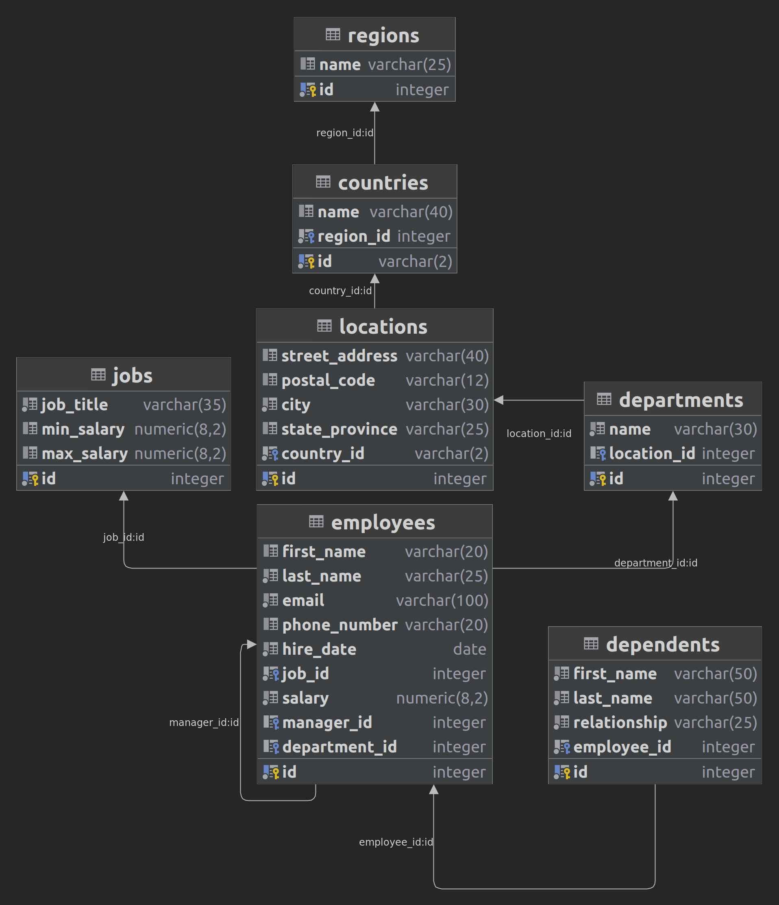
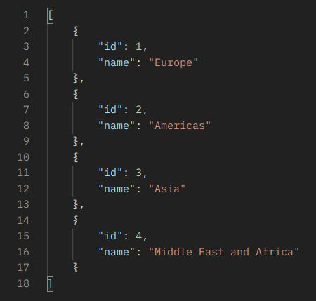
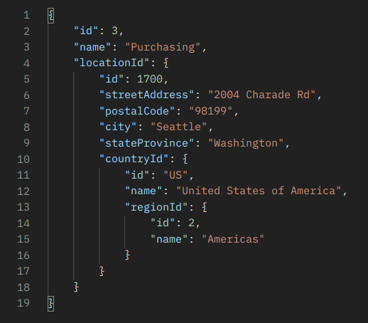

# HR management system of the small businesses

## Project structure

```
materials/                  -> Extra files
src/main/java               -> Application/Library sources
src/main/resources          -> Application/Library resources
target/                     -> All output of the build
Makefile                    -> An automating software building procedure
pom.xml                     -> Files descriptive of the project
README.md                   -> Project's readme
```

## Database diagram



## Getting started

### Run app

#### On GNU\Linux
If you try to run this app on Windows, it's great chance to download and install <a href="https://en.wikipedia.org/wiki/Windows_Subsystem_for_Linux">WSL</a> !

In root project directory:
```bash
make
```
The server is running at:
```
http://localhost:8080/regions/
```
("regions" - is a table parameter)
#### Or

Open the server app at Swagger:
```
http://localhost:8080/swagger-ui/index.html
```

## Database structure
The regions table stores the data of regions such as Asia, Europe, America, and the Middle East and Africa. The countries are grouped into regions.
```
regions
```
The locations table stores the location of the departments of the company.
```
locations
```
The jobs table stores the job data including job title and salary range.
```
jobs
```
The employees table stores the data of employees.
```
employees
```
The dependents table stores the employee’s dependents.
```
dependents
```
The departments table stores department data.
```
departments
```
The countries table stores the data of countries where the company is doing business.
```
countries
```

## Application example

1. Getting list of all regions
```
http://localhost:8080/regions/
```


2. Getting data about specific department by its id
```
http://localhost:8080/departments/3
```


### Project technology stack
1. Java (11)
2. PostgreSQL
3. Spring Boot
4. Spring Data JPA
5. Hibernate
6. Docker (including Docker-compose)

